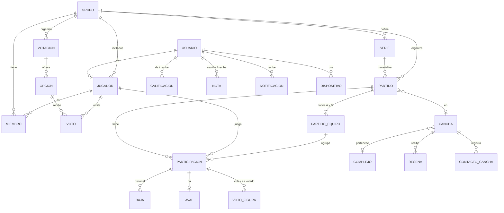

# Canchitas — Modelo de datos · v0.1

Postgres 16 + PostGIS. Fuente de verdad: `db/migrations/` (dbmate). `db/tests/reglas_test.sql` verifica 69 reglas del SRS contra el esquema con pgTAP. Las reglas para migraciones nuevas están en `db/CLAUDE.md` y en el ADR 0005.

```bash
dbmate up                                  # aplica las migraciones (DATABASE_URL)
pg_prove -d canchitas_test db/tests/*.sql  # corre los tests
```

| Migración | Contenido |
|---|---|
| `…_base` | Extensiones (citext, postgis), enums, `cupo_de()` |
| `…_identidad_grupos` | `usuario`, `jugador`, `grupo`, `miembro`, `invitado_token` |
| `…_canchas` | `complejo`, `cancha`, fotos, reclamos, reportes, contactos |
| `…_votaciones` | `votacion`, `opcion`, `voto` |
| `…_partidos` | `serie`, `partido`, `partido_equipo`, `participacion`, `baja`, `aval`, `voto_figura` |
| `…_social_moderacion` | `resena`, `calificacion`, `nota`, `denuncia`, `solicitud_historial`, `fusionar_invitado()` |
| `…_notificaciones_auditoria` | `notificacion`, `dispositivo`, `outbox`, `auditoria`, `metrica_diaria`, `borrar_cuenta()` |
| `…_vistas` | Todo lo derivado: estado del partido, estadísticas, figura, avales, deuda, radar, directorio |

## Diagrama



## Decisiones

**1. Todo lo que se juega apunta a `jugador`, no a `usuario`.** Un jugador es exactamente una de tres cosas, y un `CHECK` lo garantiza:
- la identidad de un usuario registrado (1 a 1);
- un invitado sin cuenta, que pertenece a un solo grupo;
- un "Jugador eliminado", sin datos personales.

Participaciones, votos, avales y figura no necesitan distinguir "usuario o invitado". Reclamar el historial de un invitado (RF-112) es `fusionar_invitado()`: las participaciones pasan al jugador del usuario y bajas, avales y figura las siguen por `ON UPDATE CASCADE`.

**2. Los estados que dependen del tiempo se calculan, no se guardan.**
- Votación abierta: `votacion_abierta()`.
- Estado del partido: `v_partido.estado`.
- Figura cerrada: 48 h desde `resultado_cargado_en`.
- Confirmación abierta: `confirmacion_abre_en`.

Si el worker se cae, las reglas se siguen cumpliendo; lo único que se atrasa son las notificaciones.

**3. Las estadísticas son vistas.** No hay contadores. Corregir un resultado (RF-049) recalcula todo solo. Con el volumen de RD-007 no hace falta materializar nada; si algún día pesa, `v_estadisticas_grupo` pasa a vista materializada sin tocar la API.

**4. Los avales tienen versión.** Cada carga o corrección sube `partido.resultado_version`, y `v_avales` cuenta solo los de la versión vigente (RN-11). No se borra historia. La versión la pone un trigger, no el cliente.

**5. Series como regla.** El worker materializa las próximas instancias; `UNIQUE (serie_id, fecha_serie)` impide duplicados aunque corra dos veces. Saltear una semana es cancelar esa instancia, con motivo obligatorio. "Esta y las siguientes" cierra la serie (`hasta`) y crea otra con `reemplaza_a`.

**6. Borrados.**
- Grupo: lógico (`borrado_en`). Desaparece de `v_estadisticas_grupo`, pero `v_estadisticas_global` lo sigue sumando (RN-23).
- Cuenta: `borrar_cuenta()` hace lo que pide RN-21:
  - su jugador pasa a "Jugador eliminado";
  - libera sus lugares en partidos futuros y avisa al worker por `outbox`;
  - borra notas y reseñas;
  - sus calificaciones dadas quedan anónimas y siguen contando;
  - su deuda deja de mostrarse;
  - la auditoría conserva la acción sin el actor.

**7. Preparado para v2.** `participacion` no exige membresía, y cada lado del partido (`partido_equipo.grupo_id`) puede representar a un grupo distinto. Las estadísticas por grupo usan el grupo del lado del jugador. "Falta jugador" y partidos contra otros equipos entran sin reescribir participaciones ni vistas.

**8. Plata en enteros ARS.** `v_parte` redondea hacia arriba para que la suma nunca quede por debajo del costo (TBD-06 sigue abierto: si deciden otra cosa, cambia una línea).

**9. Auditoría (TBD-08).** `auditoria` solo acepta inserts. La única modificación permitida es anonimizar al actor cuando borra su cuenta. La retención sigue sin definir.

## Invitados (TBD-13, ADR 0016)

El mail identifica al invitado que entra por link y es único por grupo. Para que "no se pueda votar en nombre de otro" hace falta que ese mail esté verificado: sin verificación, cualquiera escribe el mail de otro y vota por él. Por eso:
- el invitado recibe un enlace mágico al mail (`invitado_token`) y queda con `email_verificado_en`;
- un invitado sin mail verificado no puede votar (lo impide el trigger de `voto`);
- el mail nunca se muestra; el nombre visible es otro campo (`jugador.nombre`), también único por grupo;
- los invitados que agrega un admin por nombre (RF-111) no tienen mail y no actúan solos.

Consecuencias para el SRS:
- RF-110 decía "ingresando solo un nombre". Ahora es nombre y mail, más abrir el enlace del mail. Es más fricción justo en el caso que existía para bajar fricción.
- DEP-04 suma mails a invitados.
- RF-112 se puede simplificar: si un usuario se registra con el mismo mail verificado de un invitado, la fusión podría ser automática en vez de pedir aprobación.

## Qué valida la base y qué la API

La base es la red de seguridad para lo que, si falla, corrompe datos o viola una regla dura:
- cupo y ventana de confirmación, con lock por partido contra la carrera por el último lugar;
- votos en votaciones abiertas, solo de miembros e invitados verificados;
- avales y figura solo de participantes, sin autovoto y dentro de las 48 h;
- elegibilidad para reseñar, calificar y dejar notas;
- ocultamiento automático a las 3 denuncias;
- mayoría de edad;
- invitados sin rol de admin ni membresía en otro grupo.

La API valida el resto, con tests:
- permisos por rol (RN-07, RNF-013);
- visibilidad del radar, las notas y las bajas;
- advertencia de goles que no suman el resultado (RF-048);
- plazos de la lista de espera y notificaciones.

La librería de auth (Better Auth, ADR 0009) crea sus propias tablas y mapea su usuario a `usuario`:
- `sesion` (web y Android, 30 días desde el último uso, RNF-012), `credencial` (hash argon2id, RNF-009) y `verificacion` (tokens de recuperación, que se borran al usarse, RNF-014).
- `intento_inicio`: el bloqueo de RNF-011 lo hace la API, porque Better Auth no lo cubre. Guarda el SHA-256 del mail, no el mail.
- `dispositivo.sesion_id`: cerrar la sesión borra el dispositivo que se registró con ella (RF-007).
- **Excepción a "lo derivado no se guarda":** Better Auth solo sabe escribir `email_verificado` (boolean). Un trigger lo mantiene de acuerdo con `estado` y `email_verificado_en`, y un CHECK lo garantiza. Las tres columnas quedan porque `estado` es el lenguaje del SRS (RF-004).

## Pendiente

- TBD-04 (fotos), TBD-06 (redondeo), TBD-11 (retención de inactivos), TBD-12 (plazo de lista de espera sobre la hora) y la retención de auditoría no cambian tablas, solo valores o jobs.
- Si alguien crea un grupo y borra su cuenta, nadie puede borrar ese grupo (RN-23 dice "solo el creador"). Hay que decidir si pasa al admin más antiguo.
- Roles de Postgres con permisos mínimos (ADR 0005): hito M0.
