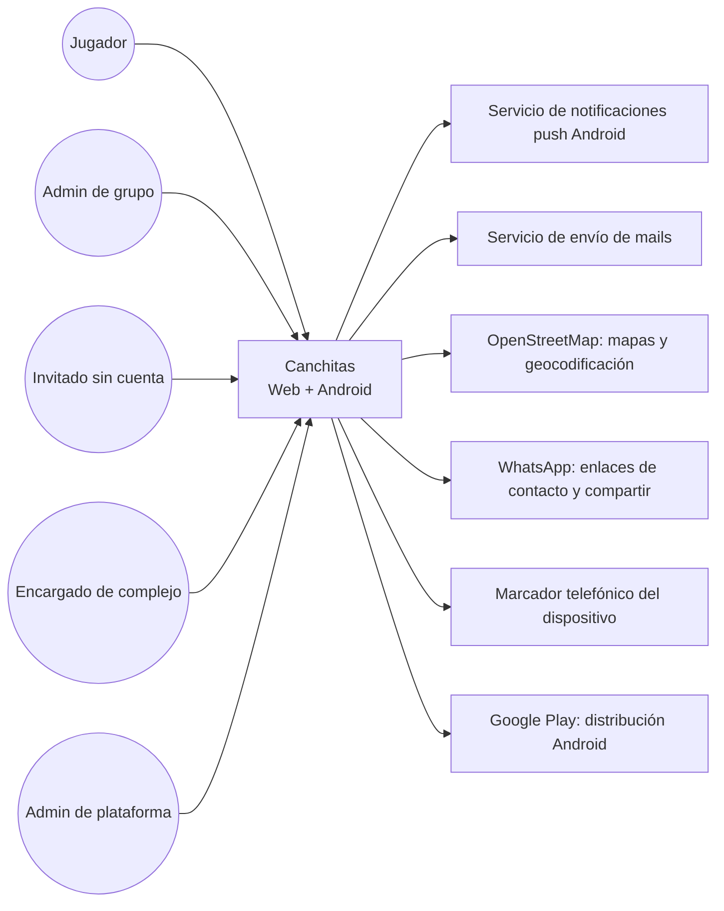
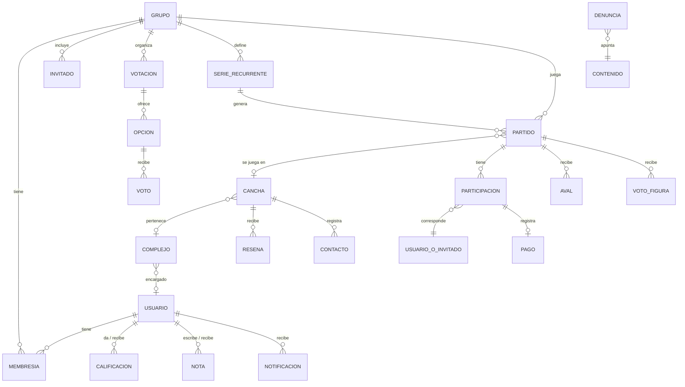
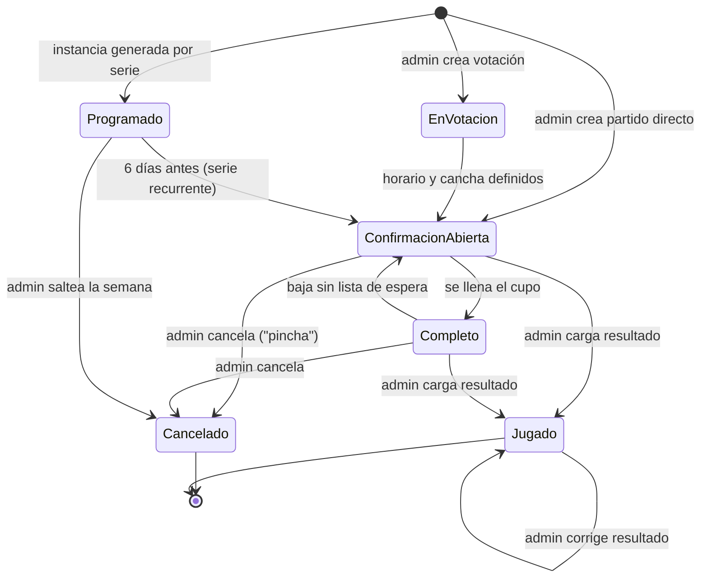

# Especificación de Requisitos de Software — Canchitas (nombre provisorio)

| Campo | Valor |
|---|---|
| Versión | 1.0 |
| Fecha | 2026-09-27 |
| Autor | Agustin, con asistencia de Claude |
| Estado | Borrador para revisión |
| Norma de referencia | ISO/IEC/IEEE 29148:2018 |

## Historial de versiones

| Versión | Fecha | Cambios |
|---|---|---|
| 1.0 | 2026-09-27 | Versión inicial, surgida de la entrevista de relevamiento |

## 1. Introducción

### 1.1 Propósito

Este documento especifica los requisitos de Canchitas, una aplicación web y Android para organizar partidos de fútbol entre amigos y encontrar canchas. Está dirigido a los dos desarrolladores del proyecto, como base para el diseño, la implementación y las pruebas, y a cualquier persona que se sume luego al proyecto (socios, testers, complejos interesados).

### 1.2 Alcance del producto

Canchitas reemplaza la organización de partidos que hoy se hace por grupos de WhatsApp: votar horario y cancha, confirmar asistencia, armar equipos parejos, registrar resultados y estadísticas, y dividir el costo de la cancha. Además ofrece un directorio de canchas con mapa y datos de contacto. En versiones futuras suma reserva de turnos en complejos adheridos, búsqueda de jugadores, partidos contra otros equipos y torneos.

- **OBJ-01:** Lograr que grupos de amigos organicen sus partidos desde la app en lugar de WhatsApp. — Métrica de éxito: 30 grupos activos a los 3 meses del lanzamiento en producción (grupo activo = 2 o más partidos organizados desde la app en los últimos 30 días).
- **OBJ-02:** Retener a los grupos que empiezan a usar la app. — Métrica de éxito: 60% de los grupos creados siguen activos 4 semanas después de su creación, medido a los 3 meses del lanzamiento.
- **OBJ-03:** Conectar jugadores con canchas. — Métricas registradas: cantidad de contactos a canchas desde la app, canchas en el directorio, canchas de complejos registrados. Sin valor objetivo definido (TBD-07).
- **OBJ-04:** Llegar a usuarios reales en el plazo acordado. — Métrica de éxito: web publicada y app Android en test cerrado de Google Play al 31/10/2026; publicación en producción de Google Play en la primera quincena de noviembre de 2026.

**Fuera de alcance de esta versión:**
- Reserva de turnos online y panel de turnos para complejos (v2).
- Publicaciones de "falta jugador" (v2).
- Partidos contra otros equipos (v2).
- Torneos (v3).
- Chat propio dentro de la app (v3); la comunicación sigue en WhatsApp.
- App para iOS.
- Inicio de sesión con Google u otros proveedores externos.
- Cobros, pagos o movimiento de dinero dentro de la app; la app solo registra quién pagó.
- Deportes distintos del fútbol.
- Usuarios menores de 18 años.
- Idiomas distintos del español y uso fuera de Argentina.
- Integración con Google Places u otras APIs pagas de lugares.

### 1.3 Definiciones, acrónimos y abreviaturas

| Término | Definición |
|---|---|
| Grupo | Conjunto de jugadores que organizan partidos entre sí (equivalente al grupo de WhatsApp de amigos). |
| Admin de grupo | Miembro del grupo con permisos para convocar, armar equipos, cargar resultados y gestionar miembros. |
| Jugador | Usuario registrado que participa en uno o más grupos. |
| Invitado | Persona sin cuenta que participa en un grupo identificada solo por un nombre. |
| Complejo | Establecimiento que alquila canchas. |
| Complejo registrado | Complejo cuyo encargado reclamó su ficha y fue verificado por el administrador de la plataforma. |
| Cancha del directorio | Cancha cargada en el directorio de la app (por el administrador de la plataforma, propuesta por un usuario y aprobada, o reclamada por un complejo). |
| Modalidad | Cantidad de jugadores por equipo: fútbol 5, 7, 8 u 11. |
| Cupo | Cantidad de jugadores que puede confirmar un partido, derivada de la modalidad (RN-01). |
| Partido recurrente | Serie de partidos que se repite cada semana en el mismo día, horario y cancha. |
| Instancia | Cada partido concreto de una serie recurrente. |
| Baja | Retiro de un jugador confirmado de un partido. |
| Antelación de la baja | Tiempo entre el momento de la baja y la hora de inicio del partido. |
| Aval | Confirmación de un participante de que el resultado y las estadísticas de un partido se cargaron correctamente. |
| Figura | Jugador más votado por los participantes de un partido. |
| Radar | Gráfico de 8 atributos (velocidad, resistencia, físico, juego aéreo, control, regate, tiro, pase) calificados de 1 a 10. |
| "Pinchar" | Cancelar un partido. |
| Admin de plataforma | Operador de Canchitas (los desarrolladores) que modera contenido y aprueba canchas y complejos. |
| MVP | Producto mínimo viable: conjunto de requisitos con prioridad Must. |
| MoSCoW | Priorización: Must (imprescindible), Should (importante), Could (deseable), Won't (fuera de esta versión). |
| AMBA | Área Metropolitana de Buenos Aires. |
| RPO / RTO | Pérdida máxima de datos aceptable / tiempo máximo de restauración ante una falla. |

### 1.4 Referencias

- ISO/IEC/IEEE 29148:2018 — Systems and software engineering — Life cycle processes — Requirements engineering.
- Ley 25.326 de Protección de los Datos Personales (Argentina).
- WCAG 2.1 — Web Content Accessibility Guidelines, nivel AA.
- Google Play Console — Requisitos de prueba para cuentas personales nuevas de desarrollador (test cerrado con 12 testers durante 14 días).
- OpenStreetMap — Políticas de uso de teselas y geocodificación.

### 1.5 Visión general del documento

- Capítulo 2: contexto del producto, usuarios, entorno, restricciones, supuestos y dependencias.
- Capítulo 3: requisitos específicos (interfaces, funcionales, de datos, no funcionales y reglas de negocio).
- Capítulo 4: forma de verificar los requisitos.
- Capítulo 5: trazabilidad, cuestiones abiertas, versiones futuras y riesgos.

## 2. Descripción general

### 2.1 Perspectiva del producto

Canchitas es un sistema nuevo. No reemplaza a otro sistema informático, sino a una práctica manual: la organización de partidos por grupos de WhatsApp (encuestas de horario, avisos de cancha, armado de equipos a mano). No hay datos a migrar.

### 2.2 Funciones del producto

- Cuentas de usuario con mail y contraseña.
- Grupos de fútbol con invitación por link o por nombre de usuario, y gestión de admins y miembros.
- Votaciones de horario y de cancha.
- Partidos únicos y recurrentes, con confirmación de asistencia, cupo, lista de espera y bajas.
- Armado manual de equipos.
- Carga de resultados, goles y asistencias; estadísticas por grupo y globales.
- Avales del resultado y votación de figura (Should).
- División del costo de la cancha y registro de pagos (Should).
- Directorio de canchas con mapa, lista, filtros, ficha y contacto por teléfono y WhatsApp.
- Propuesta de canchas por usuarios, reseñas, reportes y denuncias (parte Should).
- Reclamo y edición de fichas por complejos verificados (Should).
- Notificaciones push y dentro de la app.
- Participación de invitados sin cuenta (Should).
- Radar de habilidades con calificaciones entre jugadores y notas (Could).
- Panel de administración de la plataforma.

### 2.3 Clases y características de usuarios

| Rol | Descripción | Cantidad estimada | Nivel técnico | Funciones principales |
|---|---|---|---|---|
| Jugador | Persona de 18 años o más que juega en uno o más grupos. | 1.000 al año del lanzamiento | Usuario común de smartphone y WhatsApp | Votar, confirmar asistencia, ver estadísticas, avalar, votar figura, buscar canchas, reseñar, calificar (Could) |
| Admin de grupo | Jugador con permisos de gestión en un grupo. Puede haber más de uno por grupo (SUP-04). | 1 a 3 por grupo | Igual que jugador | Crear votaciones y partidos, gestionar miembros, armar equipos, cargar resultados, registrar pagos |
| Invitado (Should) | Persona sin cuenta que participa por link identificada por un nombre. | Sin estimación | Usuario común; no instala la app | Votar y confirmar asistencia en un grupo |
| Encargado de complejo (Should) | Responsable de un complejo que reclamó su ficha y fue verificado. | Sin estimación | Variable | Editar la ficha de su complejo |
| Organizador de torneo (v3) | Cualquier usuario registrado (SUP-05). | Sin estimación | Igual que jugador | Organizar torneos (fuera de esta versión) |
| Admin de plataforma | Los desarrolladores del proyecto. | 2 | Alto | Cargar y aprobar canchas, verificar complejos, moderar denuncias y reportes |

Un mismo usuario puede ser jugador en un grupo y admin en otro. El rol de admin de grupo es por grupo.

### 2.4 Entorno operativo

- Aplicación Android, versión 9 o superior, distribuida por Google Play.
- Aplicación web responsive, accesible desde las 2 últimas versiones estables de Chrome, Firefox, Edge y Safari, en pantallas desde 360 px de ancho.
- Conexión a Internet por 4G o Wi-Fi; sin conexión solo se permite consultar datos ya cargados (RNF-022).
- Hosting en servicios de nube con planes gratuitos o de bajo costo, dentro del presupuesto de RES-02.

### 2.5 Restricciones de diseño e implementación

| ID | Restricción | Motivo |
|---|---|---|
| RES-01 | Las plataformas de esta versión son web y Android. iOS queda excluido. | Costo de la cuenta de Apple (USD 99/año) y necesidad de compilar en Mac. |
| RES-02 | El costo de operación no deberá superar USD 25 por mes hasta los 1.000 usuarios registrados, más USD 25 de pago único por la cuenta de desarrollador de Google Play. | Proyecto autofinanciado, sin modelo de negocio definido (TBD-01). |
| RES-03 | No se usarán APIs pagas por consulta (en particular Google Places). | Presupuesto (RES-02). |
| RES-04 | Los mapas y la geocodificación se implementarán con OpenStreetMap. | Consecuencia de RES-03. |
| RES-05 | El equipo es de 2 desarrolladores; Agustin dedica 4 h por día. El desarrollo se asiste con IA. | Recursos disponibles. |
| RES-06 | Al 31/10/2026 la web deberá estar publicada y la app Android en test cerrado de Google Play. | Plazo definido por el equipo. |
| RES-07 | El tratamiento de datos personales deberá cumplir la Ley 25.326. | Obligación legal en Argentina. |
| RES-08 | La autenticación de esta versión será solo con mail y contraseña. | Decisión de alcance del equipo. |

No hay restricciones de lenguaje, framework ni base de datos.

### 2.6 Supuestos y dependencias

| ID | Supuesto / dependencia | Impacto si no se cumple |
|---|---|---|
| SUP-01 | El lanzamiento se hace en CABA y AMBA; la app funciona solo en Argentina y en español. | Habría que agregar internacionalización (idiomas, monedas, zonas horarias). |
| SUP-02 | La app es solo para fútbol; la modalidad (5, 7, 8 u 11) es un atributo del partido y no cambia los flujos. | Otros deportes requerirían revisar cupos, estadísticas y atributos del radar. |
| SUP-03 | Las metas de éxito son 30 grupos activos y 60% de retención a 4 semanas, medidas a los 3 meses del lanzamiento. | Cambian los criterios para decidir si el producto funcionó. |
| SUP-04 | Un grupo puede tener más de un admin; el creador es admin y puede designar a otros. | Cambian los permisos de gestión. |
| SUP-05 | En v3 cualquier usuario registrado podrá organizar un torneo. | Habría que crear un rol aparte con alta controlada. |
| SUP-06 | Las canchas propuestas por usuarios quedan pendientes hasta que las aprueba el admin de plataforma. | Sin aprobación, el directorio acumularía duplicados y datos erróneos. |
| SUP-07 | Los recordatorios automáticos se envían 24 h y 2 h antes del inicio del partido. | Cambian los horarios de notificación. |
| SUP-08 | Los invitados sin cuenta participan con un nombre; al registrarse pueden reclamar su historial con aprobación de un admin del grupo. | Se perderían las estadísticas previas al registro. |
| SUP-09 | El jugador de la lista de espera tiene 2 h para aceptar un lugar; si faltan menos de 2 h para el inicio, el plazo vence a la hora de inicio del partido. | Cambia la regla RN-04 (ver TBD-12). |
| SUP-10 | Los invitados pagan su parte del costo de la cancha igual que el resto. | Cambia el cálculo de RN-09. |
| SUP-11 | Cada usuario puede silenciar un grupo entero y apagar cada tipo de notificación. | Cambian las preferencias de notificación. |
| SUP-12 | El contenido con 3 denuncias o más se oculta automáticamente hasta que lo revisa el admin de plataforma. | Contenido ofensivo quedaría visible hasta la revisión manual. |
| DEP-01 | Google Play exige, para cuentas personales nuevas, un test cerrado con 12 testers inscriptos durante 14 días continuos antes de pedir acceso a producción. Se usará el grupo de fútbol del autor como testers. | Si no se consiguen 12 testers activos, la publicación en producción se atrasa. |
| DEP-02 | Servicio de notificaciones push de Android con plan gratuito. | Sin push, los recordatorios y avisos de lista de espera no llegan con la app cerrada. |
| DEP-03 | Teselas y geocodificación de OpenStreetMap dentro de sus límites de uso gratuito. | Si se exceden, habría que pagar un proveedor de teselas, en tensión con RES-02. |
| DEP-04 | Servicio de envío de mails con plan gratuito para verificación y recuperación de cuenta (TBD-09). | Sin mails, nadie puede verificar su cuenta. |
| DEP-05 | WhatsApp instalado en el dispositivo del usuario para los enlaces de contacto y compartir. | El botón de WhatsApp abre la versión web de WhatsApp o falla. |

## 3. Requisitos específicos

### 3.1 Requisitos de interfaces externas

#### 3.1.1 Interfaces de usuario

| ID | Requisito | Prioridad | Verificación |
|---|---|---|---|
| RI-001 | El sistema deberá ofrecer una aplicación Android y una aplicación web con las mismas funcionalidades de esta especificación, salvo las notificaciones push, que son exclusivas de Android. | Must | Demostración |
| RI-002 | El directorio de canchas deberá abrirse en vista de mapa por defecto. | Must | Demostración |
| RI-003 | La interfaz deberá estar en español rioplatense. | Must | Inspección |

#### 3.1.2 Interfaces de hardware

| ID | Requisito | Prioridad | Verificación |
|---|---|---|---|
| RI-004 | El sistema deberá solicitar el permiso de ubicación del dispositivo solo cuando el usuario use una función basada en distancia, y deberá seguir funcionando si el permiso se deniega. | Must | Prueba |

#### 3.1.3 Interfaces de software

| ID | Requisito | Prioridad | Verificación |
|---|---|---|---|
| RI-005 | El sistema deberá mostrar los mapas con teselas de OpenStreetMap. | Must | Inspección |
| RI-006 | El sistema deberá convertir direcciones de canchas en coordenadas mediante geocodificación de OpenStreetMap. | Must | Prueba |
| RI-007 | El sistema deberá abrir WhatsApp con el número de la cancha precargado al tocar el botón de WhatsApp de una ficha. | Must | Prueba |
| RI-008 | El sistema deberá abrir el marcador telefónico del dispositivo con el número de la cancha al tocar el botón de llamar. | Must | Prueba |
| RI-009 | El sistema deberá abrir el menú de compartir del dispositivo (o WhatsApp en la web) con un texto y un link a la votación o convocatoria. | Must | Prueba |

#### 3.1.4 Interfaces de comunicaciones

| ID | Requisito | Prioridad | Verificación |
|---|---|---|---|
| RI-010 | El sistema deberá enviar notificaciones push a la app Android mediante un servicio de notificaciones push. | Must | Prueba |
| RI-011 | El sistema deberá enviar mails solo para verificación de cuenta y recuperación de contraseña. | Must | Inspección |
| RI-012 | Toda comunicación entre clientes y servidor deberá viajar cifrada por HTTPS. | Must | Inspección |

### 3.2 Requisitos funcionales

#### 3.2.1 Cuentas de usuario

#### RF-001 — Registrarse con mail y contraseña

**Descripción:** El sistema deberá permitir a una persona crear una cuenta ingresando mail, contraseña, nombre de usuario y fecha de nacimiento.
**Prioridad:** Must
**Fuente:** Entrevista — ronda 5, punto 7
**Criterios de aceptación:**
- Dado un mail no registrado y datos válidos, cuando la persona envía el formulario, entonces se crea la cuenta en estado "Sin verificar" y se envía un mail de verificación.
- Dado un mail ya registrado, cuando la persona intenta registrarse, entonces el sistema rechaza el alta e informa que el mail ya está en uso.

#### RF-002 — Validar la edad en el registro

**Descripción:** El sistema deberá rechazar el registro de personas menores de 18 años según la fecha de nacimiento ingresada.
**Prioridad:** Must
**Fuente:** Entrevista — ronda 5, punto 8; RN-20
**Criterios de aceptación:**
- Dada una fecha de nacimiento que indica 17 años, cuando la persona intenta registrarse, entonces el sistema rechaza el alta e informa la edad requerida.
- Dada una fecha de nacimiento que indica 18 años cumplidos, cuando la persona se registra, entonces el alta se acepta.

#### RF-003 — Elegir un nombre de usuario único

**Descripción:** El sistema deberá exigir que el nombre de usuario sea único en toda la plataforma.
**Prioridad:** Must
**Fuente:** Entrevista — ronda 5, punto 7; ronda 4, punto 1 (búsqueda por nombre de usuario)
**Criterios de aceptación:**
- Dado un nombre de usuario ya tomado, cuando la persona intenta usarlo, entonces el sistema lo rechaza antes de crear la cuenta.

#### RF-004 — Verificar el mail

**Descripción:** El sistema deberá activar la cuenta cuando el usuario abra el enlace de verificación enviado a su mail.
**Prioridad:** Must
**Fuente:** Entrevista — ronda 7, punto 6
**Criterios de aceptación:**
- Dada una cuenta sin verificar, cuando el usuario abre el enlace de verificación, entonces la cuenta pasa a "Activa".
- Dada una cuenta sin verificar, cuando el usuario intenta unirse a un grupo, entonces el sistema se lo impide y le ofrece reenviar el mail de verificación.

#### RF-005 — Iniciar sesión

**Descripción:** El sistema deberá permitir al usuario iniciar sesión con su mail y contraseña.
**Prioridad:** Must
**Fuente:** Entrevista — ronda 5, punto 7
**Criterios de aceptación:**
- Dados un mail y una contraseña correctos, cuando el usuario inicia sesión, entonces accede a su cuenta.
- Dada una contraseña incorrecta, cuando el usuario intenta iniciar sesión, entonces el sistema rechaza el acceso sin indicar si el error está en el mail o en la contraseña.

#### RF-006 — Recuperar la contraseña

**Descripción:** El sistema deberá permitir al usuario definir una contraseña nueva mediante un enlace enviado a su mail registrado.
**Prioridad:** Must
**Fuente:** Entrevista — ronda 6, punto 1 (mail para recuperación)
**Criterios de aceptación:**
- Dado un mail registrado, cuando el usuario pide recuperar la contraseña, entonces recibe un mail con un enlace para definir una nueva.
- Dado un enlace de recuperación ya usado, cuando el usuario lo vuelve a abrir, entonces el sistema lo rechaza.

#### RF-007 — Cerrar sesión

**Descripción:** El sistema deberá permitir al usuario cerrar su sesión en el dispositivo actual.
**Prioridad:** Must
**Fuente:** Transversal — cuentas de usuario
**Criterios de aceptación:**
- Dado un usuario con sesión iniciada, cuando cierra sesión, entonces el dispositivo deja de mostrar sus datos y deja de recibir sus notificaciones push.

#### RF-008 — Borrar la cuenta

**Descripción:** El sistema deberá permitir al usuario borrar su cuenta, aplicando la regla de anonimización RN-21.
**Prioridad:** Must
**Fuente:** Entrevista — ronda 6, punto 3; RES-07
**Criterios de aceptación:**
- Dado un usuario que confirma el borrado, cuando se completa la operación, entonces en los partidos pasados figura como "Jugador eliminado" y las estadísticas de los demás jugadores no cambian.
- Dado un usuario borrado, cuando otra persona consulta los grupos donde participaba, entonces no puede ver su mail, nombre de usuario ni notas escritas por él.
- Dado un usuario que inicia el borrado, cuando no confirma la operación, entonces la cuenta no se borra.

#### 3.2.2 Grupos

#### RF-010 — Crear un grupo

**Descripción:** El sistema deberá permitir a un jugador crear un grupo con un nombre, quedando como admin del grupo.
**Prioridad:** Must
**Fuente:** Entrevista — ronda 2, punto 1; SUP-04
**Criterios de aceptación:**
- Dado un jugador con cuenta activa, cuando crea un grupo, entonces el grupo existe, el jugador es su admin y se genera un link de invitación.

#### RF-011 — Unirse a un grupo por link

**Descripción:** El sistema deberá permitir a un jugador con cuenta activa unirse a un grupo abriendo su link de invitación vigente, sin aprobación de un admin.
**Prioridad:** Must
**Fuente:** Entrevista — ronda 3, punto 1; ronda 4, punto 1
**Criterios de aceptación:**
- Dado un link vigente, cuando un jugador lo abre y acepta, entonces pasa a ser miembro del grupo.
- Dado un link regenerado, cuando alguien abre el link anterior, entonces el sistema informa que el link ya no es válido.
- Dado un jugador que ya es miembro, cuando abre el link, entonces el sistema lo lleva al grupo sin duplicar la membresía.

#### RF-012 — Regenerar el link de invitación

**Descripción:** El sistema deberá permitir a un admin del grupo reemplazar el link de invitación por uno nuevo, invalidando el anterior.
**Prioridad:** Must
**Fuente:** Entrevista — ronda 4, punto 1
**Criterios de aceptación:**
- Dado un admin, cuando regenera el link, entonces el link anterior deja de funcionar y el nuevo queda vigente sin vencimiento.
- Dado un jugador que no es admin, cuando intenta regenerar el link, entonces el sistema lo rechaza.

#### RF-013 — Agregar un jugador por nombre de usuario

**Descripción:** El sistema deberá permitir a un admin del grupo agregar a un jugador registrado buscándolo por su nombre de usuario.
**Prioridad:** Must
**Fuente:** Entrevista — ronda 4, punto 1; ronda 5, punto 1
**Criterios de aceptación:**
- Dado un nombre de usuario existente, cuando el admin lo agrega, entonces ese jugador pasa a ser miembro y recibe una notificación.
- Dado un nombre de usuario inexistente, cuando el admin lo busca, entonces el sistema informa que no hay resultados.

#### RF-014 — Designar admins

**Descripción:** El sistema deberá permitir a un admin del grupo otorgar el rol de admin a otro miembro del grupo.
**Prioridad:** Must
**Fuente:** SUP-04
**Criterios de aceptación:**
- Dado un admin, cuando designa a un miembro como admin, entonces ese miembro obtiene los permisos de admin en ese grupo y en ningún otro.

#### RF-015 — Pertenecer a más de un grupo

**Descripción:** El sistema deberá permitir que un jugador sea miembro de más de un grupo a la vez.
**Prioridad:** Must
**Fuente:** Entrevista — ronda 4, punto 1
**Criterios de aceptación:**
- Dado un jugador miembro de un grupo, cuando se une a otro, entonces sigue siendo miembro de ambos y ve sus partidos por separado.

#### RF-016 — Salir de un grupo

**Descripción:** El sistema deberá permitir a un miembro salir de un grupo, conservando su historial en ese grupo según RN-22.
**Prioridad:** Must
**Fuente:** Entrevista — ronda 6, punto 4
**Criterios de aceptación:**
- Dado un miembro, cuando sale del grupo, entonces deja de ver el grupo y sus partidos pasados siguen figurando en el historial del grupo.

#### RF-017 — Expulsar a un miembro

**Descripción:** El sistema deberá permitir a un admin del grupo expulsar a un miembro, conservando su historial en ese grupo según RN-22.
**Prioridad:** Must
**Fuente:** Entrevista — ronda 6, punto 4
**Criterios de aceptación:**
- Dado un admin, cuando expulsa a un miembro, entonces ese jugador deja de ver el grupo y sus partidos pasados siguen en el historial.
- Dado un jugador que no es admin, cuando intenta expulsar a otro, entonces el sistema lo rechaza.

#### RF-018 — Borrar un grupo

**Descripción:** El sistema deberá permitir solo al creador del grupo borrarlo, aplicando RN-23.
**Prioridad:** Must
**Fuente:** Entrevista — ronda 6, punto 4
**Criterios de aceptación:**
- Dado el creador del grupo, cuando confirma el borrado, entonces el grupo deja de existir y las estadísticas globales de sus miembros conservan lo sumado en ese grupo.
- Dado un admin que no es el creador, cuando intenta borrar el grupo, entonces el sistema lo rechaza.

#### 3.2.3 Votaciones

#### RF-020 — Crear una votación de horario

**Descripción:** El sistema deberá permitir a un admin del grupo crear una votación con opciones de día y horario, eligiendo al crearla si se cierra en una fecha y hora límite o manualmente.
**Prioridad:** Must
**Fuente:** Entrevista — ronda 1, punto 2; ronda 4, punto 2
**Criterios de aceptación:**
- Dado un admin, cuando crea una votación con 2 o más opciones y un modo de cierre, entonces los miembros del grupo la ven y reciben una notificación.
- Dado un jugador que no es admin, cuando intenta crear una votación, entonces el sistema lo rechaza.

#### RF-021 — Votar más de una opción

**Descripción:** El sistema deberá permitir a cada miembro marcar una o más opciones de una votación abierta.
**Prioridad:** Must
**Fuente:** Entrevista — ronda 4, punto 2
**Criterios de aceptación:**
- Dado un miembro, cuando marca las opciones "sábado 16 h" y "domingo 16 h", entonces se registran ambos votos.
- Dada una votación cerrada, cuando un miembro intenta votar, entonces el sistema lo rechaza.

#### RF-022 — Cerrar una votación

**Descripción:** El sistema deberá cerrar la votación al llegar la fecha y hora límite, o cuando un admin la cierre, según el modo elegido al crearla.
**Prioridad:** Must
**Fuente:** Entrevista — ronda 4, punto 2
**Criterios de aceptación:**
- Dada una votación con cierre a las 20:00 del jueves, cuando llega esa hora, entonces la votación se cierra y los miembros reciben una notificación con el resultado.
- Dada una votación con cierre manual, cuando un admin la cierra, entonces la votación se cierra y los miembros reciben una notificación con el resultado.

#### RF-023 — Resolver el horario ganador

**Descripción:** El sistema deberá tomar como horario ganador la opción con más votos y, si hay empate, pedir al admin que elija entre las opciones empatadas.
**Prioridad:** Must
**Fuente:** Entrevista — ronda 4, punto 2; RN-06
**Criterios de aceptación:**
- Dada una votación cerrada con una opción con más votos, cuando se cierra, entonces esa opción queda como horario del partido.
- Dada una votación cerrada con empate, cuando se cierra, entonces el sistema le pide a un admin que elija entre las opciones empatadas.

#### RF-024 — Crear una votación de cancha

**Descripción:** El sistema deberá permitir a un admin, una vez definido el horario, crear una votación de cancha cuyas opciones pueden ser canchas del directorio o canchas escritas a mano.
**Prioridad:** Must
**Fuente:** Entrevista — ronda 4, punto 2; ronda 5, punto 5
**Criterios de aceptación:**
- Dado un horario definido, cuando el admin crea la votación con una cancha del directorio y una escrita a mano, entonces ambas aparecen como opciones.
- Dada una cancha escrita a mano, cuando se muestra como opción, entonces se identifica como "fuera del directorio".

#### RF-025 — Mostrar ubicación y distancia de las canchas votadas

**Descripción:** El sistema deberá mostrar, para cada opción de cancha del directorio, su ubicación en un mapa y la distancia desde la ubicación del votante si este otorgó el permiso de ubicación.
**Prioridad:** Must
**Fuente:** Entrevista — ronda 1, punto 2 ("a unos les queda lejos"); ronda 5, punto 5
**Criterios de aceptación:**
- Dado un votante con permiso de ubicación, cuando ve la votación, entonces cada cancha del directorio muestra su distancia en kilómetros.
- Dado un votante sin permiso de ubicación, cuando ve la votación, entonces ve la ubicación en el mapa sin distancia.

#### 3.2.4 Partidos y convocatoria

#### RF-030 — Crear un partido único

**Descripción:** El sistema deberá permitir a un admin crear un partido con fecha, hora, cancha y modalidad, a partir de una votación cerrada o de forma directa.
**Prioridad:** Must
**Fuente:** Entrevista — ronda 1, punto 2; ronda 1, punto 6
**Criterios de aceptación:**
- Dado un admin, cuando crea un partido de fútbol 5, entonces el partido queda abierto a confirmaciones con un cupo de 10 jugadores (RN-01).

#### RF-031 — Crear un partido recurrente

**Descripción:** El sistema deberá permitir a un admin crear una serie de partidos que se repite cada semana en el mismo día, hora y cancha.
**Prioridad:** Must
**Fuente:** Entrevista — ronda 4, punto 2
**Criterios de aceptación:**
- Dado un admin, cuando crea una serie "sábados 23:00 en cancha X", entonces el sistema genera una instancia por semana.

#### RF-032 — Abrir la confirmación de cada instancia

**Descripción:** El sistema deberá abrir la confirmación de asistencia de cada instancia de una serie recurrente 6 días antes de su fecha y hora de inicio.
**Prioridad:** Must
**Fuente:** Entrevista — ronda 5, punto 1; RN-05
**Criterios de aceptación:**
- Dada una instancia para el sábado 10/10 a las 23:00, cuando llega el domingo 04/10 a las 23:00, entonces la confirmación se abre y los miembros reciben una notificación.

#### RF-033 — Saltear una semana de la serie

**Descripción:** El sistema deberá permitir a un admin cancelar una instancia de una serie recurrente indicando un motivo, sin afectar al resto de la serie.
**Prioridad:** Must
**Fuente:** Entrevista — ronda 5, punto 1
**Criterios de aceptación:**
- Dado un admin, cuando saltea la instancia del 12/10 con el motivo "feriado", entonces esa instancia queda cancelada, los miembros ven el motivo y la instancia siguiente no cambia.
- Dado un admin, cuando intenta saltear una instancia sin motivo, entonces el sistema pide el motivo.

#### RF-034 — Modificar el horario de una serie

**Descripción:** El sistema deberá permitir a un admin cambiar el horario de una instancia eligiendo si el cambio aplica solo a esa instancia o a esa y todas las siguientes.
**Prioridad:** Must
**Fuente:** Entrevista — ronda 5, punto 1
**Criterios de aceptación:**
- Dado un cambio "solo esta semana", cuando se guarda, entonces cambia solo esa instancia.
- Dado un cambio "esta y las siguientes", cuando se guarda, entonces cambian esa instancia y todas las futuras, y las pasadas no se modifican.

#### RF-035 — Confirmar asistencia

**Descripción:** El sistema deberá permitir a un miembro confirmar su asistencia a un partido con confirmación abierta, registrando el momento de la confirmación.
**Prioridad:** Must
**Fuente:** Entrevista — ronda 4, punto 3
**Criterios de aceptación:**
- Dado un partido con lugares libres, cuando un miembro confirma, entonces ocupa un lugar.
- Dado un partido con el cupo lleno, cuando un miembro confirma, entonces queda en la lista de espera (RF-036).

#### RF-036 — Anotarse en la lista de espera

**Descripción:** El sistema deberá ubicar en una lista de espera, ordenada por momento de confirmación, a los miembros que confirman con el cupo lleno.
**Prioridad:** Must
**Fuente:** Entrevista — ronda 4, punto 3; RN-02
**Criterios de aceptación:**
- Dado un partido completo, cuando confirman A y después B, entonces A queda primero y B segundo en la lista de espera.

#### RF-037 — Darse de baja

**Descripción:** El sistema deberá permitir a un jugador confirmado darse de baja en cualquier momento, registrando la antelación de la baja.
**Prioridad:** Must
**Fuente:** Entrevista — ronda 4, punto 3; RN-03
**Criterios de aceptación:**
- Dado un jugador confirmado para las 16:00, cuando se baja a las 13:00, entonces el sistema registra una antelación de 3 h y libera su lugar.
- Dado un jugador que se baja, cuando se libera su lugar, entonces se notifica a los admins del grupo.

#### RF-038 — Ofrecer el lugar a la lista de espera

**Descripción:** El sistema deberá, al liberarse un lugar, avisar al primero de la lista de espera y pasar el aviso al siguiente si no acepta dentro del plazo de RN-04.
**Prioridad:** Must
**Fuente:** Entrevista — ronda 5, punto 2; SUP-09
**Criterios de aceptación:**
- Dado un lugar libre, cuando el sistema avisa al primero de la lista y este acepta dentro del plazo, entonces pasa a confirmado.
- Dado un aviso sin respuesta al vencer el plazo, cuando vence, entonces el sistema avisa al siguiente de la lista.
- Dado un jugador avisado que rechaza el lugar, cuando rechaza, entonces el sistema avisa al siguiente de la lista.

#### RF-039 — Ver la antelación de las bajas

**Descripción:** El sistema deberá mostrar la antelación de las bajas de cada jugador solo a los admins del grupo.
**Prioridad:** Must
**Fuente:** Entrevista — ronda 5, punto 2
**Criterios de aceptación:**
- Dado un admin, cuando consulta el perfil de un jugador dentro del grupo, entonces ve sus bajas con la antelación de cada una.
- Dado un jugador que no es admin, cuando consulta el perfil de otro, entonces no ve esa información.

#### RF-040 — Decidir si el partido se juega sin cupo completo

**Descripción:** El sistema deberá permitir a un admin mantener o cancelar un partido que no completó el cupo.
**Prioridad:** Must
**Fuente:** Entrevista — ronda 4, punto 3
**Criterios de aceptación:**
- Dado un partido con 8 de 10 confirmados, cuando el admin lo cancela, entonces los confirmados reciben una notificación de cancelación.
- Dado un partido con 8 de 10 confirmados, cuando el admin lo mantiene, entonces el partido sigue en pie y se permite armar equipos con 8 jugadores.

#### RF-041 — Compartir una votación o convocatoria por WhatsApp

**Descripción:** El sistema deberá permitir a cualquier miembro compartir una votación o convocatoria como un mensaje de texto con link, listo para enviar a un grupo de WhatsApp.
**Prioridad:** Must
**Fuente:** Entrevista — ronda 6, punto 2
**Criterios de aceptación:**
- Dada una convocatoria, cuando un miembro toca "compartir", entonces se abre el menú de compartir con un texto que incluye fecha, hora, cancha y el link al partido.

#### 3.2.5 Equipos y resultados

#### RF-045 — Armar equipos manualmente

**Descripción:** El sistema deberá permitir a un admin asignar cada jugador confirmado a uno de los dos equipos del partido.
**Prioridad:** Must
**Fuente:** Entrevista — ronda 1, punto 2; ronda 4, punto 4
**Criterios de aceptación:**
- Dado un partido con 10 confirmados, cuando el admin asigna 5 a cada lado, entonces los jugadores ven su equipo en el partido.
- Dado un jugador que se baja después de asignado, cuando se baja, entonces sale del equipo y el admin recibe una notificación.

#### RF-046 — Ver estadísticas al armar equipos

**Descripción:** El sistema deberá mostrar al admin, mientras arma los equipos, una vista de los jugadores con sus estadísticas en el grupo.
**Prioridad:** Must
**Fuente:** Entrevista — ronda 5, punto 5
**Criterios de aceptación:**
- Dado un admin armando equipos, cuando elige la vista "estadísticas", entonces ve, para cada confirmado, partidos jugados, ganados, empatados, perdidos, goles y asistencias en ese grupo.

#### RF-047 — Cargar el resultado del partido

**Descripción:** El sistema deberá permitir a un admin cargar el resultado final de un partido jugado.
**Prioridad:** Must
**Fuente:** Entrevista — ronda 4, punto 5
**Criterios de aceptación:**
- Dado un partido cuya hora de inicio ya pasó, cuando el admin carga "5 a 3", entonces el partido pasa a "Jugado" y los participantes reciben una notificación.
- Dado un partido cuya hora de inicio no pasó, cuando el admin intenta cargar el resultado, entonces el sistema lo rechaza.
- Dado un jugador que no es admin, cuando intenta cargar el resultado, entonces el sistema lo rechaza.

#### RF-048 — Cargar goles y asistencias

**Descripción:** El sistema deberá permitir a un admin registrar los goles y asistencias de cada participante del partido.
**Prioridad:** Must
**Fuente:** Entrevista — ronda 1 (pedido inicial); ronda 4, punto 5
**Criterios de aceptación:**
- Dado un resultado 5 a 3, cuando el admin registra goles cuya suma por equipo no coincide con el resultado, entonces el sistema le advierte la diferencia antes de guardar.

#### RF-049 — Corregir un resultado

**Descripción:** El sistema deberá permitir a un admin corregir el resultado, los goles y las asistencias de un partido en cualquier momento.
**Prioridad:** Must
**Fuente:** Entrevista — ronda 4, punto 5
**Criterios de aceptación:**
- Dado un partido con resultado cargado, cuando el admin lo corrige, entonces las estadísticas por grupo y globales de los participantes se recalculan.
- Dado un partido con avales (RF-055), cuando el admin lo corrige, entonces todos los avales y rechazos se reinician.

#### 3.2.6 Estadísticas

#### RF-050 — Ver estadísticas por grupo

**Descripción:** El sistema deberá mostrar, para cada jugador en cada grupo, partidos jugados, ganados, empatados y perdidos, goles y asistencias en ese grupo.
**Prioridad:** Must
**Fuente:** Entrevista — ronda 1 (pedido inicial); ronda 4, puntos 5 y 6
**Criterios de aceptación:**
- Dado un jugador con 3 partidos en el grupo A y 2 en el grupo B, cuando se consulta su perfil dentro del grupo A, entonces figuran 3 partidos jugados.

#### RF-051 — Ver estadísticas globales

**Descripción:** El sistema deberá mostrar en el perfil del jugador sus estadísticas sumadas de todos los grupos.
**Prioridad:** Must
**Fuente:** Entrevista — ronda 4, punto 6
**Criterios de aceptación:**
- Dado un jugador con 3 partidos en el grupo A y 2 en el grupo B, cuando consulta su perfil global, entonces figuran 5 partidos jugados.

#### RF-052 — Limitar las estadísticas visibles dentro de un grupo

**Descripción:** El sistema deberá mostrar dentro de cada grupo solo las estadísticas generadas en ese grupo.
**Prioridad:** Must
**Fuente:** Entrevista — ronda 4, punto 6
**Criterios de aceptación:**
- Dado un miembro del grupo A, cuando consulta el perfil de otro miembro desde el grupo A, entonces no ve las estadísticas del grupo B.

#### 3.2.7 Avales y figura

#### RF-055 — Avalar o rechazar la carga de un partido

**Descripción:** El sistema deberá permitir a cada participante de un partido marcar si el resultado y las estadísticas se cargaron correctamente o no.
**Prioridad:** Should
**Fuente:** Entrevista — ronda 4, punto 5
**Criterios de aceptación:**
- Dado un participante, cuando marca "correcto", entonces se suma un aval.
- Dado un miembro que no participó del partido, cuando intenta avalar, entonces el sistema lo rechaza.
- Dado un participante que ya avaló, cuando cambia a "incorrecto", entonces su aval se reemplaza por un rechazo.

#### RF-056 — Mostrar el conteo de avales

**Descripción:** El sistema deberá mostrar en cada partido la cantidad de avales y de rechazos.
**Prioridad:** Should
**Fuente:** Entrevista — ronda 5, punto 6
**Criterios de aceptación:**
- Dado un partido con 7 avales y 1 rechazo, cuando un miembro lo consulta, entonces ve "7 avales, 1 rechazo" sin bloqueo de las estadísticas.

#### RF-057 — Avisar al admin de un rechazo

**Descripción:** El sistema deberá notificar a los admins del grupo cada vez que un participante rechaza la carga de un partido.
**Prioridad:** Should
**Fuente:** Entrevista — ronda 5, punto 6
**Criterios de aceptación:**
- Dado un rechazo nuevo, cuando se registra, entonces cada admin del grupo recibe una notificación.

#### RF-058 — Votar la figura del partido

**Descripción:** El sistema deberá abrir, al cargarse el resultado, una votación de figura entre los participantes que cierra 48 h después, según RN-10.
**Prioridad:** Should
**Fuente:** Entrevista — ronda 4, punto 5; ronda 5, punto 6
**Criterios de aceptación:**
- Dado un participante, cuando vota a otro participante, entonces se registra su voto.
- Dado un participante, cuando intenta votarse a sí mismo, entonces el sistema lo rechaza.
- Dada una votación de figura, cuando pasan 48 h desde su apertura, entonces se cierra y se notifica la figura.

#### RF-059 — Resolver empates de figura

**Descripción:** El sistema deberá declarar figura compartida a todos los participantes empatados con más votos.
**Prioridad:** Should
**Fuente:** Entrevista — ronda 5, punto 6
**Criterios de aceptación:**
- Dados 2 jugadores con 3 votos cada uno y el resto con menos, cuando cierra la votación, entonces ambos quedan como figura del partido.

#### RF-060 — Contar las figuras en las estadísticas

**Descripción:** El sistema deberá sumar a las estadísticas por grupo y globales la cantidad de veces que cada jugador fue figura.
**Prioridad:** Should
**Fuente:** Entrevista — ronda 4, punto 5
**Criterios de aceptación:**
- Dado un jugador elegido figura en 2 partidos del grupo A, cuando se consulta su perfil en el grupo A, entonces figura "2 veces figura".

#### 3.2.8 División de costos

#### RF-065 — Registrar el costo de la cancha

**Descripción:** El sistema deberá permitir a un admin registrar el costo total de la cancha de un partido.
**Prioridad:** Should
**Fuente:** Entrevista — ronda 4 (pedido de división de costos)
**Criterios de aceptación:**
- Dado un partido, cuando el admin registra un costo de $60.000, entonces el costo queda asociado al partido.

#### RF-066 — Calcular la parte de cada jugador

**Descripción:** El sistema deberá calcular la parte de cada participante dividiendo el costo en partes iguales entre todos los que jugaron, invitados incluidos, según RN-09.
**Prioridad:** Should
**Fuente:** Entrevista — ronda 5, punto 7; SUP-10
**Criterios de aceptación:**
- Dado un costo de $60.000 y 10 participantes, cuando se calcula, entonces a cada uno le corresponden $6.000.
- Dado un cambio en la lista de participantes, cuando el admin lo guarda, entonces las partes se recalculan.

#### RF-067 — Marcar un pago

**Descripción:** El sistema deberá permitir solo a un admin marcar que un participante pagó su parte.
**Prioridad:** Should
**Fuente:** Entrevista — ronda 5, punto 7
**Criterios de aceptación:**
- Dado un admin, cuando marca pagado a un participante, entonces su parte figura como pagada.
- Dado un jugador que no es admin, cuando intenta marcar un pago, entonces el sistema lo rechaza.

#### RF-068 — Mostrar la deuda acumulada

**Descripción:** El sistema deberá mostrar a los miembros del grupo la deuda pendiente de cada jugador, acumulando las partes impagas de todos los partidos del grupo.
**Prioridad:** Should
**Fuente:** Entrevista — ronda 5, punto 7; RN-09
**Criterios de aceptación:**
- Dado un jugador con $6.000 impagos de un partido y $5.000 de otro, cuando se consulta su deuda en el grupo, entonces figura $11.000.

#### 3.2.9 Directorio de canchas

#### RF-070 — Ver canchas en un mapa

**Descripción:** El sistema deberá mostrar las canchas del directorio como marcadores en un mapa.
**Prioridad:** Must
**Fuente:** Entrevista — ronda 6, punto 2
**Criterios de aceptación:**
- Dado un usuario que abre el directorio, cuando se carga, entonces ve el mapa con las canchas aprobadas del área visible.

#### RF-071 — Ver canchas en una lista

**Descripción:** El sistema deberá permitir al usuario cambiar a una vista de lista del directorio.
**Prioridad:** Must
**Fuente:** Entrevista — ronda 6, punto 2
**Criterios de aceptación:**
- Dado un usuario en la vista de mapa, cuando elige "lista", entonces ve las mismas canchas en una lista con nombre, zona y modalidades.

#### RF-072 — Filtrar canchas

**Descripción:** El sistema deberá permitir filtrar el directorio por zona o barrio, modalidad, superficie (sintético, natural, cemento) y cancha techada.
**Prioridad:** Must
**Fuente:** Entrevista — ronda 6, punto 2
**Criterios de aceptación:**
- Dado el filtro "fútbol 5 + sintético", cuando se aplica, entonces solo se muestran canchas con esa modalidad y esa superficie.
- Dado un filtro sin resultados, cuando se aplica, entonces el sistema informa que no hay canchas y ofrece proponer una (RF-078).

#### RF-073 — Filtrar canchas por distancia

**Descripción:** El sistema deberá permitir filtrar el directorio por distancia a la ubicación del usuario cuando este otorgó el permiso de ubicación.
**Prioridad:** Must
**Fuente:** Entrevista — ronda 6, punto 2; RI-004
**Criterios de aceptación:**
- Dado un usuario con permiso de ubicación, cuando filtra "hasta 5 km", entonces solo ve canchas a 5 km o menos.
- Dado un usuario sin permiso de ubicación, cuando intenta filtrar por distancia, entonces el sistema le pide el permiso y, si lo deniega, el filtro no se aplica.

#### RF-074 — Ver la ficha de una cancha

**Descripción:** El sistema deberá mostrar una ficha de cada cancha con nombre, dirección, teléfono, fotos, modalidades, superficies y si es techada.
**Prioridad:** Must
**Fuente:** Entrevista — ronda 6, punto 3
**Criterios de aceptación:**
- Dada una cancha del directorio, cuando el usuario abre su ficha, entonces ve los datos cargados y los botones de contacto.

#### RF-075 — Llamar a una cancha

**Descripción:** El sistema deberá ofrecer en la ficha un botón que inicie una llamada al teléfono de la cancha.
**Prioridad:** Must
**Fuente:** Entrevista — ronda 6, punto 3; RI-008
**Criterios de aceptación:**
- Dada una ficha con teléfono, cuando el usuario toca "llamar", entonces se abre el marcador con el número.

#### RF-076 — Escribir por WhatsApp a una cancha

**Descripción:** El sistema deberá ofrecer en la ficha un botón que abra una conversación de WhatsApp con el número de la cancha.
**Prioridad:** Must
**Fuente:** Entrevista — ronda 6, punto 3; RI-007
**Criterios de aceptación:**
- Dada una ficha con número de WhatsApp, cuando el usuario toca el botón, entonces se abre WhatsApp con ese número.

#### RF-077 — Contabilizar los contactos

**Descripción:** El sistema deberá registrar cada toque en los botones de llamar y de WhatsApp como un contacto a la cancha.
**Prioridad:** Must
**Fuente:** Entrevista — ronda 6, punto 3; OBJ-03
**Criterios de aceptación:**
- Dado un usuario que toca "llamar" en una ficha, cuando lo hace, entonces el contador de contactos de esa cancha aumenta en 1.

#### RF-078 — Proponer una cancha

**Descripción:** El sistema deberá permitir a un usuario registrado proponer una cancha que no está en el directorio, quedando en estado "Pendiente" hasta su aprobación.
**Prioridad:** Must
**Fuente:** Entrevista — ronda 3, punto 2; SUP-06
**Criterios de aceptación:**
- Dada una propuesta con nombre, dirección y teléfono, cuando se envía, entonces queda pendiente y no aparece en el directorio.
- Dada una propuesta aprobada por el admin de plataforma, cuando se aprueba, entonces aparece en el directorio y el autor recibe una notificación.

#### RF-079 — Mostrar precio en canchas de complejos registrados

**Descripción:** El sistema deberá mostrar el precio y permitir filtrar por precio solo en canchas de complejos registrados.
**Prioridad:** Should
**Fuente:** Entrevista — ronda 6, punto 2; RN-24
**Criterios de aceptación:**
- Dada una cancha de un complejo registrado con precio cargado, cuando se ve su ficha, entonces se muestra el precio.
- Dada una cancha no registrada, cuando se ve su ficha, entonces no se muestra precio.

#### RF-080 — Reportar datos incorrectos de una ficha

**Descripción:** El sistema deberá permitir a un usuario registrado reportar que una ficha tiene datos incorrectos, indicando el motivo.
**Prioridad:** Should
**Fuente:** Entrevista — ronda 6, punto 4
**Criterios de aceptación:**
- Dado un usuario, cuando reporta "el teléfono no anda", entonces el reporte llega a la cola del admin de plataforma.

#### 3.2.10 Reseñas y denuncias

#### RF-085 — Reseñar una cancha

**Descripción:** El sistema deberá permitir reseñar una cancha con un puntaje de 1 a 5 y un texto opcional, solo a usuarios que jugaron ahí un partido con resultado cargado, según RN-14.
**Prioridad:** Should
**Fuente:** Entrevista — ronda 6, punto 3; ronda 7, punto 5
**Criterios de aceptación:**
- Dado un usuario que participó de un partido con resultado cargado en la cancha X del directorio, cuando la reseña con 4 puntos, entonces la reseña se publica.
- Dado un usuario sin partidos jugados en la cancha X, cuando intenta reseñarla, entonces el sistema lo rechaza.

#### RF-086 — Denunciar contenido

**Descripción:** El sistema deberá permitir a un usuario registrado denunciar una reseña, una nota o una ficha de cancha.
**Prioridad:** Should
**Fuente:** Entrevista — ronda 6, punto 5
**Criterios de aceptación:**
- Dado un usuario, cuando denuncia una reseña, entonces la denuncia llega a la cola del admin de plataforma.
- Dado un usuario que ya denunció un contenido, cuando lo vuelve a denunciar, entonces no se suma una segunda denuncia.

#### RF-087 — Ocultar contenido denunciado

**Descripción:** El sistema deberá ocultar automáticamente todo contenido que acumule 3 denuncias de usuarios distintos hasta que el admin de plataforma lo revise.
**Prioridad:** Should
**Fuente:** SUP-12
**Criterios de aceptación:**
- Dada una reseña con 2 denuncias, cuando recibe la tercera, entonces deja de mostrarse a los usuarios.
- Dada una reseña oculta, cuando el admin de plataforma la restaura, entonces vuelve a mostrarse.

#### 3.2.11 Complejos

#### RF-090 — Reclamar la ficha de un complejo

**Descripción:** El sistema deberá permitir a un usuario registrado solicitar la titularidad de la ficha de un complejo.
**Prioridad:** Should
**Fuente:** Entrevista — ronda 3, punto 3; ronda 6, punto 6
**Criterios de aceptación:**
- Dado un usuario, cuando solicita reclamar una ficha, entonces la solicitud queda pendiente de verificación y la ficha no cambia.

#### RF-091 — Verificar un complejo

**Descripción:** El sistema deberá permitir al admin de plataforma aprobar o rechazar una solicitud de reclamo después de verificarla manualmente.
**Prioridad:** Should
**Fuente:** Entrevista — ronda 6, punto 6
**Criterios de aceptación:**
- Dada una solicitud aprobada, cuando se aprueba, entonces el solicitante pasa a ser encargado del complejo y recibe una notificación.
- Dada una solicitud rechazada, cuando se rechaza, entonces el solicitante recibe una notificación y la ficha no cambia.

#### RF-092 — Editar la ficha del complejo

**Descripción:** El sistema deberá permitir al encargado verificado editar los datos de la ficha de su complejo.
**Prioridad:** Should
**Fuente:** Entrevista — ronda 6, punto 6
**Criterios de aceptación:**
- Dado un encargado verificado, cuando edita el teléfono, entonces el cambio se publica.
- Dado un usuario que no es encargado de ese complejo, cuando intenta editar la ficha, entonces el sistema lo rechaza.

#### 3.2.12 Administración de la plataforma

#### RF-095 — Cargar canchas en el directorio

**Descripción:** El sistema deberá permitir al admin de plataforma crear fichas de canchas directamente publicadas.
**Prioridad:** Must
**Fuente:** Entrevista — ronda 3, punto 2 (opción A)
**Criterios de aceptación:**
- Dado el admin de plataforma, cuando crea una ficha, entonces aparece en el directorio sin pasar por aprobación.

#### RF-096 — Editar y dar de baja fichas de canchas

**Descripción:** El sistema deberá permitir al admin de plataforma editar o dar de baja cualquier ficha del directorio.
**Prioridad:** Must
**Fuente:** Entrevista — ronda 3, punto 2 (opción A); ronda 6, punto 4
**Criterios de aceptación:**
- Dada una ficha dada de baja, cuando un usuario busca canchas, entonces no aparece; los partidos pasados en esa cancha conservan su nombre.

#### RF-097 — Aprobar canchas propuestas

**Descripción:** El sistema deberá permitir al admin de plataforma aprobar o rechazar las canchas propuestas por usuarios.
**Prioridad:** Must
**Fuente:** SUP-06
**Criterios de aceptación:**
- Dada una propuesta pendiente, cuando el admin la rechaza, entonces no aparece en el directorio y el autor recibe una notificación.

#### RF-098 — Revisar denuncias y reportes

**Descripción:** El sistema deberá mostrar al admin de plataforma una cola de denuncias y reportes pendientes, permitiendo eliminar o restaurar el contenido afectado.
**Prioridad:** Should
**Fuente:** Entrevista — ronda 6, punto 5; RF-080; RF-086
**Criterios de aceptación:**
- Dada una denuncia pendiente, cuando el admin elimina el contenido, entonces el contenido deja de existir y la denuncia se cierra.
- Dado un usuario que no es admin de plataforma, cuando intenta acceder a la cola, entonces el sistema lo rechaza.

#### RF-099 — Registrar métricas de uso

**Descripción:** El sistema deberá registrar, por fecha, las cantidades de usuarios registrados, grupos creados, partidos organizados, canchas del directorio, canchas de complejos registrados y contactos a canchas, y mostrarlas al admin de plataforma.
**Prioridad:** Must
**Fuente:** Entrevista — ronda 1, punto 5; OBJ-01; OBJ-02; OBJ-03
**Criterios de aceptación:**
- Dado el admin de plataforma, cuando consulta las métricas, entonces ve la cantidad de grupos activos según la definición de OBJ-01.
- Dado el admin de plataforma, cuando consulta las métricas, entonces ve el porcentaje de grupos activos a 4 semanas de su creación según OBJ-02.

#### 3.2.13 Notificaciones

#### RF-100 — Enviar notificaciones push

**Descripción:** El sistema deberá enviar una notificación push a la app Android ante cada evento de la tabla RN-25 que corresponda al usuario.
**Prioridad:** Must
**Fuente:** Entrevista — ronda 7, punto 1
**Criterios de aceptación:**
- Dado un usuario con la app Android instalada y cerrada, cuando se crea una votación en su grupo, entonces recibe una notificación push.
- Dado un usuario sin sesión iniciada en ningún dispositivo Android, cuando ocurre un evento, entonces no se envía push y el evento queda en sus notificaciones dentro de la app.

#### RF-101 — Mostrar notificaciones dentro de la app

**Descripción:** El sistema deberá mostrar en la web y en Android una bandeja de notificaciones con los eventos de la tabla RN-25.
**Prioridad:** Must
**Fuente:** Entrevista — ronda 7, punto 1
**Criterios de aceptación:**
- Dado un usuario en la web, cuando se cierra una votación de su grupo, entonces aparece la notificación en su bandeja.

#### RF-102 — Enviar recordatorios del partido

**Descripción:** El sistema deberá enviar a los jugadores confirmados un recordatorio 24 h antes y otro 2 h antes del inicio del partido.
**Prioridad:** Must
**Fuente:** Entrevista — ronda 4, punto 3; SUP-07
**Criterios de aceptación:**
- Dado un partido el sábado a las 16:00, cuando llega el viernes a las 16:00, entonces los confirmados reciben el primer recordatorio.
- Dado un jugador que se bajó, cuando llega la hora del recordatorio, entonces no lo recibe.

#### RF-103 — Silenciar un grupo

**Descripción:** El sistema deberá permitir a un usuario silenciar todas las notificaciones de un grupo.
**Prioridad:** Should
**Fuente:** SUP-11
**Criterios de aceptación:**
- Dado un grupo silenciado, cuando ocurre un evento en ese grupo, entonces no se envía push y el evento queda en la bandeja.

#### RF-104 — Desactivar tipos de notificación

**Descripción:** El sistema deberá permitir a un usuario desactivar cada tipo de notificación de la tabla RN-25.
**Prioridad:** Should
**Fuente:** SUP-11
**Criterios de aceptación:**
- Dado un usuario que desactivó "votación de figura", cuando se abre una votación de figura, entonces no recibe push por ese evento.

#### 3.2.14 Invitados sin cuenta

#### RF-110 — Participar como invitado por link

**Descripción:** El sistema deberá permitir a una persona sin cuenta, desde el link de invitación abierto en la web, votar y confirmar asistencia en ese grupo ingresando solo un nombre.
**Prioridad:** Should
**Fuente:** Entrevista — ronda 2, punto 4; ronda 3, punto 7; SUP-08
**Criterios de aceptación:**
- Dada una persona sin cuenta, cuando abre el link e ingresa "Tomi", entonces puede votar y confirmar asistencia en ese grupo.
- Dado un invitado, cuando intenta acceder a otro grupo, entonces el sistema le pide crear una cuenta.

#### RF-111 — Agregar un invitado por nombre

**Descripción:** El sistema deberá permitir a un admin agregar a un partido o grupo a un invitado identificado solo por un nombre.
**Prioridad:** Should
**Fuente:** Entrevista — ronda 3, punto 7; SUP-08
**Criterios de aceptación:**
- Dado un admin, cuando agrega al invitado "Primo de Juan", entonces puede asignarlo a un equipo y registrarle goles.

#### RF-112 — Reclamar el historial de invitado

**Descripción:** El sistema deberá permitir a un usuario registrado solicitar que se le asigne el historial de un invitado del grupo, sujeto a aprobación de un admin del grupo.
**Prioridad:** Should
**Fuente:** Entrevista — ronda 3, punto 7; SUP-08
**Criterios de aceptación:**
- Dada una solicitud aprobada por un admin, cuando se aprueba, entonces las estadísticas del invitado pasan al usuario y el invitado deja de existir.
- Dada una solicitud rechazada, cuando se rechaza, entonces el historial del invitado no cambia.

#### 3.2.15 Calificaciones y radar

#### RF-120 — Autocalificarse

**Descripción:** El sistema deberá permitir a un jugador calificarse a sí mismo de 1 a 10 en cada uno de los 8 atributos del radar.
**Prioridad:** Could
**Fuente:** Entrevista — ronda 4, punto 4
**Criterios de aceptación:**
- Dado un jugador, cuando se califica, entonces su radar propio muestra esos valores.
- Dado un valor fuera del rango 1 a 10, cuando se ingresa, entonces el sistema lo rechaza.

#### RF-121 — Calificar a otro jugador

**Descripción:** El sistema deberá permitir a un jugador calificar de 1 a 10 los 8 atributos de otro jugador con quien compartió al menos un partido con resultado cargado, según RN-15 y la configuración del calificado.
**Prioridad:** Could
**Fuente:** Entrevista — ronda 4, punto 4; ronda 5, punto 3
**Criterios de aceptación:**
- Dados dos jugadores con un partido jugado en común, cuando uno califica al otro, entonces la calificación se registra.
- Dados dos jugadores sin partidos en común, cuando uno intenta calificar al otro, entonces el sistema lo rechaza.
- Dado un jugador con "recibir calificaciones" desactivado, cuando otro intenta calificarlo, entonces el sistema lo rechaza.

#### RF-122 — Reemplazar una calificación

**Descripción:** El sistema deberá reemplazar la calificación anterior cuando un jugador vuelve a calificar a la misma persona.
**Prioridad:** Could
**Fuente:** Entrevista — ronda 5, punto 3
**Criterios de aceptación:**
- Dado un jugador que calificó "tiro 5" a otro, cuando lo califica "tiro 7", entonces cuenta solo el 7 en el promedio.

#### RF-123 — Ver el radar

**Descripción:** El sistema deberá mostrar el radar de autocalificación y el radar con el promedio de las calificaciones recibidas de otros, sin identificar a quién calificó.
**Prioridad:** Could
**Fuente:** Entrevista — ronda 4, punto 4; ronda 5, punto 3
**Criterios de aceptación:**
- Dado un jugador con 1 calificación recibida, cuando se consulta su radar, entonces se muestra el promedio con esa calificación (RN-16).
- Dado un jugador con calificaciones recibidas, cuando alguien consulta su radar, entonces no se muestra la identidad de ningún calificador.

#### RF-124 — Configurar la recepción de calificaciones

**Descripción:** El sistema deberá permitir al jugador activar o desactivar la recepción de calificaciones.
**Prioridad:** Could
**Fuente:** Entrevista — ronda 5, punto 3; ronda 6, punto 1
**Criterios de aceptación:**
- Dado un jugador que desactiva la recepción, cuando otro intenta calificarlo, entonces el sistema lo rechaza.

#### RF-125 — Configurar quién puede calificar

**Descripción:** El sistema deberá permitir al jugador elegir si pueden calificarlo solo compañeros de sus grupos o cualquiera que haya jugado con él.
**Prioridad:** Could
**Fuente:** Entrevista — ronda 6, punto 1
**Criterios de aceptación:**
- Dado un jugador con la opción "solo compañeros de mis grupos", cuando lo intenta calificar alguien que jugó con él pero no comparte grupo, entonces el sistema lo rechaza.

#### RF-126 — Configurar quién ve el radar y las notas

**Descripción:** El sistema deberá permitir al jugador elegir si su radar y sus notas los ve solo él, los miembros de sus grupos o cualquier usuario.
**Prioridad:** Could
**Fuente:** Entrevista — ronda 5, punto 4; ronda 6, punto 1
**Criterios de aceptación:**
- Dado un jugador con visibilidad "solo yo", cuando otro usuario consulta su perfil, entonces no ve el radar ni las notas.

#### RF-127 — Dejar una nota

**Descripción:** El sistema deberá permitir a un jugador habilitado para calificar a otro dejarle una nota de texto firmada con su nombre de usuario.
**Prioridad:** Could
**Fuente:** Entrevista — ronda 4, punto 4; ronda 5, punto 4
**Criterios de aceptación:**
- Dada una nota, cuando se publica, entonces muestra el nombre de usuario del autor y es visible según la configuración del destinatario (RF-126).
- Dada una nota, cuando alguien la denuncia, entonces se aplica RF-086.

#### RF-128 — Ver capacidades al armar equipos

**Descripción:** El sistema deberá ofrecer al admin, mientras arma los equipos, una vista "capacidades" con el radar promedio de cada confirmado, mostrando el radar vacío para los jugadores con radar no visible para él.
**Prioridad:** Could
**Fuente:** Entrevista — ronda 5, punto 5; ronda 6, punto 1
**Criterios de aceptación:**
- Dado un confirmado con radar visible para sus grupos, cuando el admin elige la vista "capacidades", entonces ve su radar promedio.
- Dado un confirmado con visibilidad "solo yo", cuando el admin elige la vista "capacidades", entonces ve su radar vacío.

### 3.3 Requisitos de datos

| ID | Requisito | Prioridad | Verificación |
|---|---|---|---|
| RD-001 | El sistema deberá almacenar por usuario: mail, contraseña no recuperable en texto plano, nombre de usuario único, fecha de nacimiento y estado de la cuenta. | Must | Inspección |
| RD-002 | El sistema deberá almacenar por participación en un partido: equipo, goles, asistencias, momento de confirmación, momento y antelación de la baja si la hubo, y estado de pago. | Must | Inspección |
| RD-003 | El sistema deberá almacenar por cancha: nombre, dirección, coordenadas, teléfono, número de WhatsApp, modalidades, superficies, si es techada, fotos, estado (pendiente, publicada, dada de baja) y complejo asociado si lo hay. | Must | Inspección |
| RD-004 | El sistema deberá conservar los partidos, resultados y estadísticas mientras exista el grupo, y los datos de cuenta mientras exista la cuenta. | Must | Inspección |
| RD-005 | Al borrarse una cuenta, el sistema deberá eliminar mail, nombre de usuario, fecha de nacimiento y notas escritas, y reemplazar la identidad del usuario en partidos pasados por "Jugador eliminado" (RN-21). | Must | Prueba |
| RD-006 | El sistema deberá almacenar las calificaciones con referencia al calificador para aplicar RN-15 y RF-122, sin exponer esa referencia a ningún usuario. | Could | Inspección |
| RD-007 | El sistema deberá dimensionarse para 1.000 usuarios, 150 grupos y 600 partidos por mes al año del lanzamiento. | Must | Análisis |
| RD-008 | El sistema deberá registrar cada contacto a una cancha con la cancha, la fecha y el tipo (llamada o WhatsApp). | Must | Prueba |

Los volúmenes de RD-007 derivan de 1.000 usuarios a 1 año (RNF-023) y de grupos de 10 jugadores que juegan 1 partido por semana; son una estimación de dimensionamiento, no una meta.

### 3.4 Requisitos no funcionales

#### 3.4.1 Rendimiento

| ID | Requisito | Métrica / umbral | Prioridad | Verificación |
|---|---|---|---|---|
| RNF-001 | Las pantallas de la app deberán cargar su contenido en poco tiempo con conexión 4G. | 95% de las cargas en menos de 2 s, con 200 usuarios concurrentes | Must | Prueba de carga |
| RNF-002 | Un voto, una confirmación o una baja deberá verse reflejado para los demás miembros del grupo. | En menos de 10 s desde que se registra | Must | Prueba |
| RNF-003 | El sistema deberá atender usuarios concurrentes cumpliendo RNF-001. | 200 usuarios concurrentes | Must | Prueba de carga |

#### 3.4.2 Disponibilidad y confiabilidad

| ID | Requisito | Métrica / umbral | Prioridad | Verificación |
|---|---|---|---|---|
| RNF-004 | El sistema deberá estar disponible. | 99% mensual (hasta 7,3 h de caída por mes) | Must | Análisis de monitoreo |
| RNF-005 | Los mantenimientos programados deberán hacerse fuera de los fines de semana. | Solo de lunes a jueves | Must | Inspección |
| RNF-006 | El sistema deberá respaldar la base de datos. | 1 backup por día | Must | Inspección |
| RNF-007 | Ante una falla, la pérdida de datos no deberá superar el umbral. | RPO de 24 h | Must | Prueba de restauración |
| RNF-008 | Ante una falla, el servicio deberá restaurarse dentro del umbral. | RTO de 24 h | Must | Prueba de restauración |

#### 3.4.3 Seguridad

| ID | Requisito | Métrica / umbral | Prioridad | Verificación |
|---|---|---|---|---|
| RNF-009 | Las contraseñas deberán almacenarse de forma que no puedan recuperarse en texto plano. | Hash con sal mediante una función de derivación de claves con factor de costo configurable (bcrypt o argon2) | Must | Inspección |
| RNF-010 | Toda comunicación cliente-servidor deberá estar cifrada. | 100% del tráfico por HTTPS | Must | Inspección |
| RNF-011 | El sistema deberá bloquear el inicio de sesión tras intentos fallidos. | 15 min de bloqueo después de 5 intentos fallidos consecutivos | Must | Prueba |
| RNF-012 | La sesión en Android deberá mantenerse sin volver a pedir contraseña. | 30 días desde el último uso | Must | Prueba |
| RNF-013 | Toda acción restringida a un rol (admin de grupo, encargado de complejo, admin de plataforma) deberá validarse en el servidor. | 0 acciones restringidas ejecutables desde un cliente modificado | Must | Prueba de seguridad |
| RNF-014 | Los enlaces de verificación y de recuperación de contraseña deberán ser de un solo uso. | 1 uso por enlace | Must | Prueba |

#### 3.4.4 Privacidad y cumplimiento normativo

| ID | Requisito | Métrica / umbral | Prioridad | Verificación |
|---|---|---|---|---|
| RNF-015 | El sistema deberá permitir el ejercicio del derecho de supresión de la Ley 25.326 mediante el borrado de cuenta (RF-008). | Borrado completado en menos de 24 h desde la confirmación | Must | Prueba |
| RNF-016 | El sistema deberá usar la ubicación del dispositivo solo con permiso explícito del usuario. | 0 accesos a la ubicación sin permiso otorgado | Must | Inspección |
| RNF-017 | El sistema no deberá revelar a ningún usuario la identidad de quien realizó una calificación. | 0 pantallas o respuestas de la API que expongan al calificador | Could | Prueba |
| RNF-018 | El sistema deberá mostrar la política de privacidad y requerir su aceptación en el registro. | 100% de las cuentas con aceptación registrada | Must | Inspección |

#### 3.4.5 Usabilidad y accesibilidad

| ID | Requisito | Métrica / umbral | Prioridad | Verificación |
|---|---|---|---|---|
| RNF-019 | La interfaz deberá cumplir los criterios de contraste y tamaño de texto de WCAG 2.1 nivel AA. | 0 fallas de contraste AA en las pantallas principales | Must | Inspección con herramienta de auditoría |
| RNF-020 | La web deberá adaptarse a pantallas angostas. | Sin desplazamiento horizontal desde 360 px de ancho | Must | Inspección |

#### 3.4.6 Mantenibilidad

No se relevaron requisitos de mantenibilidad (cobertura de pruebas, documentación, estándares de código). Queda como cuestión abierta TBD-05.

#### 3.4.7 Portabilidad y compatibilidad

| ID | Requisito | Métrica / umbral | Prioridad | Verificación |
|---|---|---|---|---|
| RNF-021 | La app Android deberá funcionar en las versiones indicadas. | Android 9 (API 28) o superior | Must | Prueba en dispositivos |
| RNF-022 | Sin conexión, la app deberá mostrar los datos ya cargados y rechazar las acciones que modifican datos informando la falta de conexión. | Próximo partido, equipos y estadísticas visibles sin conexión; 0 acciones de escritura aceptadas sin conexión | Must | Prueba |
| RNF-023 | La web deberá funcionar en los navegadores indicados. | Las 2 últimas versiones estables de Chrome, Firefox, Edge y Safari | Must | Prueba |

#### 3.4.8 Escalabilidad

| ID | Requisito | Métrica / umbral | Prioridad | Verificación |
|---|---|---|---|---|
| RNF-024 | El sistema deberá cumplir RNF-001 a RNF-003 con el volumen previsto al año del lanzamiento, dentro del presupuesto de RES-02. | 1.000 usuarios registrados; costo de operación de USD 25 por mes o menos | Must | Prueba de carga y análisis de costos |

#### 3.4.9 Internacionalización

| ID | Requisito | Métrica / umbral | Prioridad | Verificación |
|---|---|---|---|---|
| RNF-025 | Todas las fechas y horas deberán mostrarse en la zona horaria de Argentina. | America/Argentina/Buenos_Aires (UTC−3) | Must | Prueba |
| RNF-026 | Los importes de la división de costos deberán expresarse en pesos argentinos. | Moneda ARS | Should | Inspección |

#### 3.4.10 Auditoría y registro

No se relevaron requisitos de auditoría más allá de las métricas de uso (RF-099) y del registro de contactos (RD-008). Queda como cuestión abierta TBD-08 qué acciones de admins y de moderación deben quedar registradas.

### 3.5 Reglas de negocio

| ID | Regla | Ejemplo |
|---|---|---|
| RN-01 | El cupo de un partido es 2 × la cantidad de jugadores por equipo de su modalidad. | Fútbol 5: 10; fútbol 7: 14; fútbol 8: 16; fútbol 11: 22. |
| RN-02 | La lista de espera se ordena por el momento de confirmación, del más antiguo al más reciente. | A confirma a las 10:00 y B a las 10:05: A queda primero. |
| RN-03 | La antelación de una baja es la diferencia entre la hora de inicio del partido y el momento de la baja. Las bajas se permiten en cualquier momento. | Partido 16:00, baja 13:00: antelación 3 h. |
| RN-04 | El jugador avisado de la lista de espera tiene 2 h para aceptar; si faltan menos de 2 h para el inicio, el plazo vence a la hora de inicio. Sin respuesta, se avisa al siguiente. | Aviso a las 10:00 para un partido a las 16:00: vence a las 12:00. |
| RN-05 | La confirmación de cada instancia de una serie recurrente se abre 6 días antes de su inicio. | Instancia sábado 23:00: abre el domingo anterior a las 23:00. |
| RN-06 | Si una votación cierra con empate, un admin elige entre las opciones empatadas. | Sábado y domingo con 6 votos cada uno: decide el admin al reservar. |
| RN-07 | Solo los admins de un grupo pueden crear votaciones, crear partidos, armar equipos, cargar resultados, registrar costos y marcar pagos. | Un jugador sin rol de admin no ve esas acciones. |
| RN-08 | Si un partido no completa el cupo, un admin decide si se juega o se cancela. | 8 de 10: el admin decide. |
| RN-09 | La parte de cada participante es el costo total dividido por la cantidad de participantes que jugaron, invitados incluidos. Las partes impagas se acumulan como deuda del jugador en el grupo. | $60.000 / 10 = $6.000 por jugador. |
| RN-10 | La votación de figura se abre al cargarse el resultado y cierra 48 h después. Solo votan los participantes; nadie se vota a sí mismo; si hay empate en el primer puesto, la figura es compartida. | 2 jugadores con 3 votos: ambos figura. |
| RN-11 | Solo los participantes de un partido pueden avalar o rechazar su carga. Cualquier corrección del resultado reinicia todos los avales y rechazos. Los rechazos no bloquean las estadísticas. | 7 avales, corrección: 0 avales. |
| RN-12 | El resultado se puede corregir en cualquier momento. | Corrección 2 semanas después: estadísticas recalculadas. |
| RN-13 | Las canchas propuestas por usuarios se publican solo después de la aprobación del admin de plataforma. | Propuesta: estado "Pendiente". |
| RN-14 | Solo puede reseñar una cancha quien participó en un partido con resultado cargado jugado en esa cancha del directorio. Los partidos en canchas escritas a mano no habilitan reseñas. | Jugó en cancha X del directorio: puede reseñar X. |
| RN-15 | Solo puede calificar a un jugador quien compartió con él al menos un partido con resultado cargado, respetando la configuración del calificado (RF-124, RF-125). Los invitados no califican ni son calificados. | Sin partidos en común: no puede calificar. |
| RN-16 | El radar de otros es el promedio aritmético, por atributo, de las calificaciones recibidas, excluida la autocalificación. Se muestra desde la primera calificación. | Tiro: 6 y 8 → 7. |
| RN-17 | Si el radar de un jugador no es visible para el admin, la vista "capacidades" lo muestra vacío. | Visibilidad "solo yo": radar vacío. |
| RN-18 | Las notas se firman con el nombre de usuario del autor y se ven según la configuración del destinatario. | — |
| RN-19 | Un contenido con 3 denuncias de usuarios distintos se oculta hasta la revisión del admin de plataforma. | Tercera denuncia: oculto. |
| RN-20 | Solo pueden registrarse personas de 18 años o más. | 17 años: alta rechazada. |
| RN-21 | Al borrar una cuenta: en partidos pasados figura "Jugador eliminado"; se borran sus notas escritas; sus calificaciones dadas siguen contando en los promedios; sus deudas desaparecen. | — |
| RN-22 | Cuando un miembro sale o es expulsado, su historial de partidos se conserva en el grupo. | — |
| RN-23 | Solo el creador puede borrar un grupo; las estadísticas globales de los miembros conservan lo sumado en ese grupo. | — |
| RN-24 | El precio de una cancha se muestra solo si pertenece a un complejo registrado. | Cancha no registrada: sin precio. |
| RN-25 | Eventos que generan notificación: nueva votación; cierre de votación; partido confirmado; apertura de confirmación de un partido recurrente; recordatorios 24 h y 2 h antes; aviso de lista de espera; baja de un jugador (solo admins); resultado cargado; rechazo de aval (solo admins); votación de figura abierta; figura elegida; deuda pendiente; calificación o nota recibida; propuesta de cancha aprobada o rechazada; reclamo de complejo aprobado o rechazado; agregado a un grupo. | — |

Estados de un partido:

## 4. Verificación

- **Requisitos funcionales:** prueba de cada criterio de aceptación, manual o automatizada, sobre la web y sobre un dispositivo Android 9 o superior.
- **Requisitos de interfaz:** demostración en ambas plataformas; inspección de los enlaces a WhatsApp, marcador y compartir.
- **Rendimiento y escalabilidad:** prueba de carga con 200 usuarios concurrentes simulados antes de pasar a producción.
- **Disponibilidad y respaldo:** monitoreo mensual de disponibilidad; una prueba de restauración de backup antes del lanzamiento en producción.
- **Seguridad:** prueba de permisos intentando acciones de admin desde una cuenta sin rol; inspección del almacenamiento de contraseñas y del uso de HTTPS.
- **Accesibilidad:** auditoría automatizada de contraste en las pantallas principales.
- **Validación con usuarios:** el test cerrado de Google Play (DEP-01), con el grupo de fútbol del autor como testers durante 14 días, sirve como prueba de aceptación del MVP.
- **Responsables:** los dos desarrolladores del proyecto. Agustin aprueba este documento.

## 5. Apéndices

### Apéndice A — Matriz de trazabilidad

| Objetivo | Requisitos | Verificación |
|---|---|---|
| OBJ-01 | RF-010 a RF-018, RF-020 a RF-025, RF-030 a RF-041, RF-045 a RF-052, RF-100 a RF-102, RF-110 a RF-112, RF-099 | Prueba; métricas en producción |
| OBJ-02 | RF-050 a RF-052, RF-055 a RF-060, RF-065 a RF-068, RF-120 a RF-128, RF-099 | Métricas de retención en producción |
| OBJ-03 | RF-070 a RF-080, RF-085 a RF-087, RF-090 a RF-092, RF-095 a RF-097, RF-099, RD-008 | Prueba; métricas de contactos |
| OBJ-04 | RES-01, RES-06, DEP-01, RNF-021, RNF-023 | Publicación verificada en Google Play y en la web |

### Apéndice B — Cuestiones abiertas

| ID | Cuestión | Responsable / cómo se resuelve | Requisitos afectados | Riesgo |
|---|---|---|---|---|
| TBD-01 | Modelo de negocio (comisión por reserva, suscripción de complejos, premium para grupos, publicidad). | Agustin, antes de diseñar v2 | Reservas (v2), RES-02 | Medio |
| TBD-02 | Resuelta: el inicio de sesión con Google queda fuera de esta versión (RES-08). | — | RF-001, RF-005 | Bajo |
| TBD-03 | ¿Un miembro puede cambiar o retirar su voto antes del cierre de una votación? | Agustin, antes de implementar RF-021 | RF-021 | Bajo |
| TBD-04 | Fotos de canchas: quién las sube, formatos y tamaño por archivo. | Agustin, antes de implementar RF-074 | RF-074, RF-095, RD-003 | Bajo |
| TBD-05 | Requisitos de mantenibilidad: pruebas automatizadas, documentación, estándares de código. | Equipo de desarrollo | 3.4.6 | Medio |
| TBD-06 | Redondeo de la parte de cada jugador cuando la división no da un número entero. | Agustin, antes de implementar RF-066 | RF-066, RN-09 | Bajo |
| TBD-07 | Valores objetivo para contactos a canchas, canchas en el directorio y canchas de complejos registrados. | Agustin | OBJ-03 | Bajo |
| TBD-08 | Qué acciones de admins de grupo y de moderación deben quedar registradas, y por cuánto tiempo. | Agustin | 3.4.10 | Medio |
| TBD-09 | Proveedor de envío de mails y límite del plan gratuito. | Equipo de desarrollo | RF-001, RF-004, RF-006, DEP-04 | Medio |
| TBD-10 | Cantidad y zona de canchas a precargar en el directorio antes del lanzamiento. | Agustin, antes del test cerrado | RF-070 a RF-074, R-02 | Alto |
| TBD-11 | Retención de datos de cuentas y grupos sin actividad. | Agustin | RD-004 | Bajo |
| TBD-12 | Plazo de aceptación de la lista de espera cuando faltan pocos minutos para el inicio del partido. | Agustin | RF-038, RN-04 | Bajo |
| TBD-13 | Cómo se evita que dos invitados usen el mismo nombre o que alguien vote en nombre de otro invitado. | Agustin, antes de implementar RF-110 | RF-110, RF-111 | Medio |

### Apéndice C — Funcionalidades para versiones futuras

**v2**
- Reserva de turnos online en complejos registrados, con panel de disponibilidad para el encargado.
- Publicaciones de "falta jugador": los interesados se postulan y el admin del grupo admite a quien elija.
- Partidos contra otros equipos: cada equipo está formado por quienes confirmaron de su lado para ese partido, sean o no miembros del grupo.

**v3**
- Torneos en cualquier formato (liga, eliminación directa, fase de grupos más eliminación); el organizador decide qué equipos admite.
- Chat propio dentro de la app.

**Sin versión asignada**
- App para iOS.
- Inicio de sesión con Google.
- Apertura a menores de 18 años, con controles y consentimiento de padres o tutores.

### Apéndice D — Riesgos

| ID | Riesgo | Mitigación prevista |
|---|---|---|
| R-01 | El anonimato de las calificaciones es débil: sin un umbral de calificaciones, un jugador con 1 calificador puede deducir quién fue. | Decisión aceptada por el autor; revisar tras el test cerrado. |
| R-02 | El directorio de canchas arranca vacío porque no se usa una fuente automática de lugares. | Precarga manual antes del lanzamiento (TBD-10); propuestas de usuarios. |
| R-03 | El plazo de octubre choca con el test cerrado obligatorio de Google Play (14 días con 12 testers). | Meta de octubre redefinida como test cerrado; producción en noviembre. |
| R-04 | Los grupos siguen usando WhatsApp como canal principal y abandonan la app. | Botón de compartir a WhatsApp (RF-041); participación de invitados sin cuenta (RF-110) como primer candidato a subir a Must. |
| R-05 | Las calificaciones y notas entre amigos generan conflictos en los grupos. | Configuración de privacidad por usuario, notas firmadas y denunciables. |
